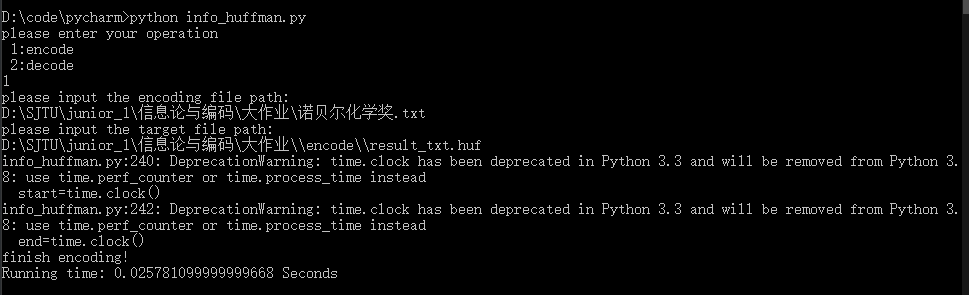

# encode-decode
encode/decode files with huffman and lz

run info_huffman.py
>python info_huffman.py

1、输入所需要进行的操作
>1:encode
>2:decode

2、输入待解码（编码）文件路径
>please input the encoding file path:
D:\SJTU\junior_1\信息论与编码\大作业\诺贝尔化学奖.txt 

3、输入目标文件路径（生成编码或解码后的文件）
>please input the target file path:    
D:\SJTU\junior_1\信息论与编码\大作业\\encode\\result_txt.huf

---
运行截图如下

